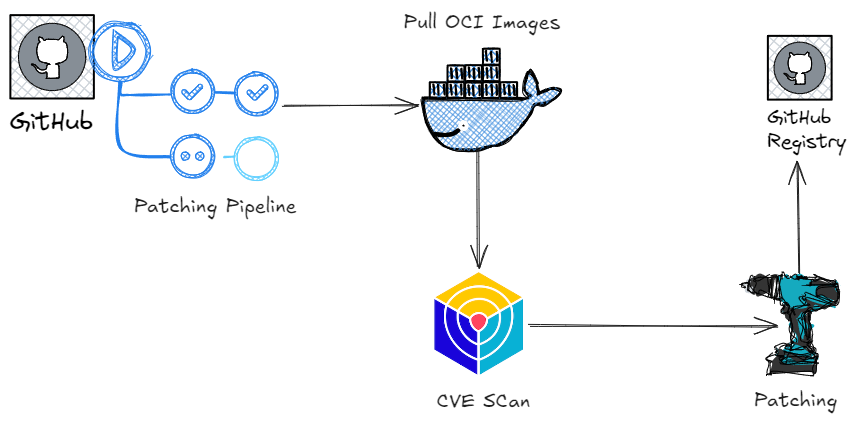

<p align="center">
  <a href="https://alfonsofortunato.com">
    <picture>
      <source media="(prefers-color-scheme: dark)" srcset="https://alfonsofortunato.com/img/logo.png">
      
    </picture>
    <h1 align="center">Secure your Image with Trivy and Copacetic</h1>
  </a>
</p>

<p align="center">
  <a href="https://github.com/MovieMaker93/demo-avellino-linux-day-2024/commit">
    
  </a>
  <a href="https://github.com/MovieMaker93/demo-avellino-linux-day-2024/blob/main/LICENSE">
    
  </a>
</p>

<div style="text-align: center;">
  <h1>
    Secure your Image
  </h1>
</div>

Ensuring that your base image is secure is crucial for minimizing the attack surface and addressing both existing and future OS vulnerabilities (CVEs). Instead of waiting for an upstream base image to be updated, you can take control by patching the image yourself with a new "Patched Layer."

Why should you patch the image yourself?
- Empowers DevSecOps Engineers to fix vulnerabilities in container images
- Reduces storage and transmission costs
- Avoids delays caused by waiting for upstream updates
- Simplifies the process, reducing complexity over full image rebuilds

## Table of Contents

- [Pipeline Architecture](#architecture)
- [Pipeline Steps](#steps)

<a id="architecture"></a>
<h2>
  <picture>
    
  </picture>
   Pipeline Architecture
</h2>

 

The steps are:
- Run the github action (manually or by pushing on the repo)
- Pull OCI Images from registries
- Run the Trivy Scan for generating vulnerability report
- Patch the image with Copacetic
- Push the patched image to Github Registry


<a id="steps"></a>
<h2>
  <picture>
    
  </picture>
   Pipeline Steps
</h2>

## Trivy db cache


To speed up the pipeline and avoid rate limitations when using Trivy for scanning, a good practice is to cache the vulnerability database instead of downloading it every time. This can significantly improve performance and reliability during the scanning process.
```yaml
     - id: trivy-db
       name: Check trivy db sha
       env:
         GH_TOKEN: ${{ github.token }}
       run: |
         endpoint='/orgs/aquasecurity/packages/container/trivy-db/versions'
         headers='Accept: application/vnd.github+json'
         jqFilter='.[] | select(.metadata.container.tags[] | contains("latest")) | .name | sub("sha256:";"")'
         sha=$(gh api -H "${headers}" "${endpoint}" | jq --raw-output "${jqFilter}")
         echo "Trivy DB sha256:${sha}"
         echo "sha=${sha}" >> $GITHUB_OUTPUT
```
It checks whether the current `sha` is the same of the remote one. 

## Trivy scan for OS vulnerabilities

The second step is the Trivy scan for fixed vulnerabilites OS:
```yaml
      - name: Generate Trivy Report
        uses: aquasecurity/trivy-action@0.27.0
        with:
          scan-type: "image"
          format: "json"
          output: "report.json"
          ignore-unfixed: true
          vuln-type: "os"
          image-ref: ${{ matrix.images }}
          cache-dir: .trivy
```
The output from the Trivy scan is stored in a report.json file, which is used in subsequent steps to tally the actual number of vulnerabilities. This allows for easy tracking of potential security risks and helps in assessing the overall security posture of the scanned environment.

## Count and Display of vulnerabilites pre patched

```yaml
      - name: Check vulnerability count
        id: vuln_count
        run: |
          report_file="report.json"
          vuln_count=$(jq 'if .Results then [.Results[] | select(.Class=="os-pkgs" and .Vulnerabilities!=null) | .Vulnerabilities[]] | length else 0 end' "$report_file")
          echo "vuln_count=$vuln_count" >> $GITHUB_OUTPUT
      - name: Display vulnerability count
        run: |
          echo "Vulnerability Count: ${{ steps.vuln_count.outputs.vuln_count }}"
```

## Copa action
This step is designed to address and fix the vulnerabilities identified during the Trivy scan:
```yaml
      - name: Run Copa action
        if: steps.vuln_count.outputs.vuln_count != '0'
        id: copa
        uses: project-copacetic/copa-action@v1.2.1
        with:
          image: ${{ matrix.images }}
          image-report: "report.json"
          patched-tag: ${{ env.PATCHED_TAG }}
          output: openvex.json
```
It leverages the report.json as base for patching the vulns.

## Push the image to Github Registry
```yaml
      - name: Login to GHCR
        if: steps.copa.conclusion == 'success'
        id: login
        uses: docker/login-action@343f7c4344506bcbf9b4de18042ae17996df046d # v3.0.0
        with:
          registry: ghcr.io
          username: ${{ github.actor }}
          password: ${{ secrets.GITHUB_TOKEN }}
      - name: Push patched image
        if: steps.login.conclusion == 'success'
        run: |
          # retag if needed
          docker tag ${{ steps.copa.outputs.patched-image }} ghcr.io/moviemaker93/demo-avellino-linux-day-2024/${{ env.IMAGE_NAME }}:${{ env.PATCHED_TAG }}
          docker push ghcr.io/moviemaker93/demo-avellino-linux-day-2024/${{ env.IMAGE_NAME }}:${{env.PATCHED_TAG}}
```

## Scan the patched image
Final check to ensure that the vulns are corrected patched trough the copa action:
```yaml
      - name: Pull patched image
        if: steps.login.conclusion == 'success'
        run: |
          # retag if needed
          docker pull ghcr.io/moviemaker93/demo-avellino-linux-day-2024/${{ env.IMAGE_NAME }}:${{env.PATCHED_TAG}}
      - name: Generate Trivy Report for Patched
        uses: aquasecurity/trivy-action@0.27.0
        with:
          scan-type: "image"
          format: "json"
          output: "report-patched.json"
          ignore-unfixed: true
          vuln-type: "os"
          image-ref: "ghcr.io/moviemaker93/demo-avellino-linux-day-2024/${{ env.IMAGE_NAME }}:${{env.PATCHED_TAG}}"
      - name: Check vulnerability count Patched
        id: vuln_count_patched
        run: |
          report_file="report-patched.json"
          vuln_count=$(jq 'if .Results then [.Results[] | select(.Class=="os-pkgs" and .Vulnerabilities!=null) | .Vulnerabilities[]] | length else 0 end' "$report_file")
          echo "vuln_count_patched=$vuln_count" >> $GITHUB_OUTPUT
      - name: Display vulnerability count Patched
        run: |
          echo "Vulnerability Count: ${{ steps.vuln_count_patched.outputs.vuln_count_patched }}"
```
