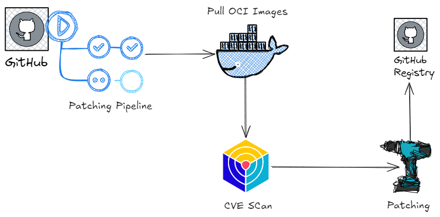

  <a href="https://alfonsofortunato.com">
    <picture>
      <source media="(prefers-color-scheme: dark)" srcset="https://alfonsofortunato.com/img/logo.png">
      
    </picture>
    <h1 align="center">Secure your Image with Trivy and Copacetic</h1>
  </a>

  
  

  <h1>
    Secure your Image
  </h1>

Ensuring that your base image is secure is crucial for minimizing the attack surface and addressing both existing and future OS vulnerabilities (CVEs). Instead of waiting for an upstream base image to be updated, you can take control by patching the image yourself with a new "Patched Layer."

Why should you patch the image yourself?
- Empowers DevSecOps Engineers to fix vulnerabilities in container images
- Reduces storage and transmission costs
- Avoids delays caused by waiting for upstream updates
- Simplifies the process, reducing complexity over full image rebuilds

## Table of Contents

- [Pipeline Architecture](#architecture)
- [Pipeline Steps](#steps)

<h2>
  <picture>
    
  </picture>
   Pipeline Architecture
</h2>

 

The steps are:
- Run the github action (manually or by pushing on the repo)
- Pull OCI Images from registries
- Run the Trivy Scan for generating vulnerability report
- Patch the image with Copacetic
- Push the patched image to Github Registry

<h2>
  <picture>
    
  </picture>
   Pipeline Steps
</h2>

